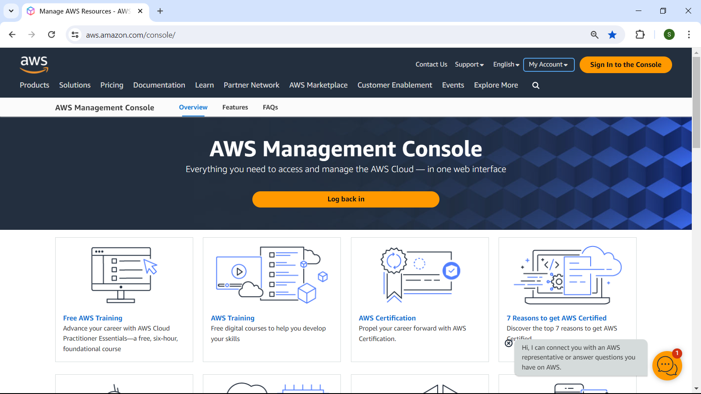

# This repository contains the step-by-step instructions to setup a static web site on Amazon Web Services (AWS) Simple Storage Service (S3).

## Pre-requisites for this tutorial:
- You have an AWS login account.
- You have the required permissions to create S3 buckets and to upload data files to the buckets.

## Step 1

Sign-in to the AWS Management Console at this link https://aws.amazon.com/console/




At the Services search box, type s3 and press Enter.

Select the first item (i.e. S3) from the Search results for 's3'.


Click the __Create bucket__ button on the right.

At the __Create bucket__ page, select/specify/enter the following details:
- Bucket type: General purpose.
- Bucket name: static-web-site-20240422.
- Object ownership: ACLs disabled (recommended).
- Block Public Access settings for this bucket: Untick checkbox.
- I acknowledge that the current settings might result in this bucket and the objects within becoming public. Tick checkbox.
- Bucket Bucket Versioning: Disable.
- Default encryption: Server-side encryption with Amazon S3 managed keys (SSE-S3).
- Bucket Key: Disabled.


Click the __Create bucket__ button.

Note that your bucket name MUST BE globally unique in the whole AWS. That means if someone else has already used the bucket name that you chose, AWS S3 will alert you. If that is the case, please change the bucket name to one that is likely to be unique, for example like in my case, tag a date or datetime to your bucket name, i.e. static-web-site-20240422.

Here is the screenshot of the created bucket:


Click the bucket name at the last line of the previous screenshot, which will bring you to another screen that shows you the details of the bucket:


Click the Properties tab and scroll all the way down to the last section of this tab:


For newly created bucket, the setting should be Disabled.

Click the __Edit__ button located on the right side of the Static website hosting section.


Enter the following details:
- Index document: index.html
- Error document - optional: error.html


Click the Save changes button.


Click the Permission tab.


Click the Edit button on the right of the Bucket policy section.

Type the following texts at the Body section:

``` json
{
  "Version": "2012-10-17",
  "Statement": [
    {
      "Effect": "Allow",
      "Principal": "*",
      "Action": "s3:GetObject",
      "Resource": "arn:aws:s3:::static-web-site-20240422/*"
    }
  ]
}
```


Click the Save changes button located at the bottom right of the screen.


Click the Objects tab and then click the Upload button.


Upload these 2 files found in the web_page folder of my repository:


And then click the Upload button.


At the Upload: status screen, click the Close button.

After performing the above steps, you should have completed all the steps necessary to host your web site.

But before you can use internet browser to view your web site, you need to obtain the address or the URL of your web site.

You can obtain this information by clicking the index.html file.


Click the Copy icon (2 squares overlapping each other) next to the https://static-web-site-20240422.s3.amazonaws.com/index.html which is highlighted in the screen.

Go to your favourite Internet Browser and paste the copied texts at the address bar of the browser:


